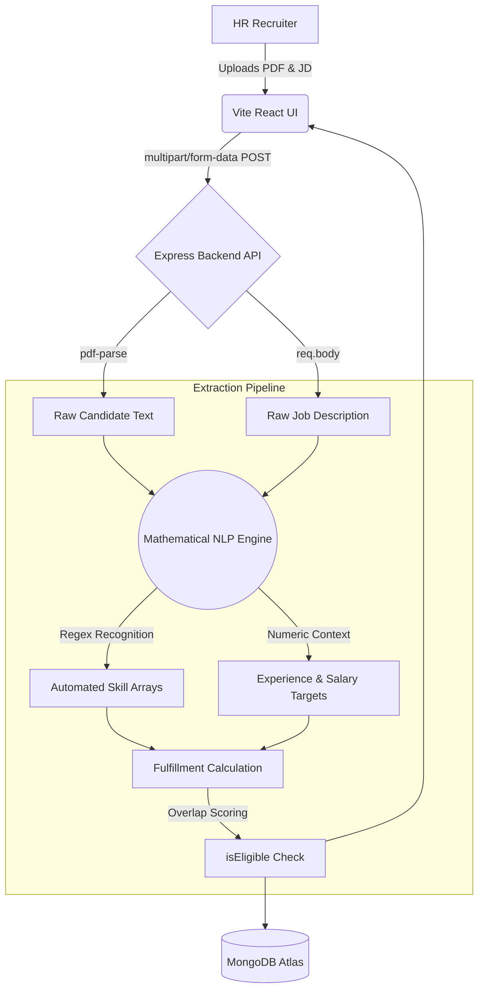

# 🚀 Intelligent ATS Parsing & Matching Engine
**Rule-Based Document Extraction System (Hidani Tech Assessment)**

A highly scalable, algorithm-driven Applicant Tracking System (ATS) designed to mathematically cross-reference an applicant's PDF Resume against a target Job Description. This engine explicitly avoids Generative AI/LLMs to guarantee 100% predictable, bias-free, and hyper-fast parsing natively through context-aware Regular Expressions.


---

## 🧠 System Architecture Mind Map



---

## 🛠 Tech Stack

| Domain | Technologies Used | Purpose |
| ------ | ----------------- | ------- |
| **Frontend** | React, Vite, Vanilla CSS | High-performance, modern HR-focused Glassmorphism Dashboard. |
| **Backend** | Node.js, Express.js | Robust API handling memory-buffered file uploads in a serverless environment. |
| **Parser** | pdf-parse, Native RegEx | Raw binary extraction and context-aware pattern recognition. |
| **Database** | MongoDB, Mongoose | Persistent tracking of Candidates, Extracted Logs, and Match Analytics. |
| **DevOps** | Docker, Docker Compose | Universal containerization for zero-configuration deployments. |

---

## ⚙️ Core Engine Workflow

1. **Dual-Input:** The user supplies an open-text Job Description and uploads a Candidate's PDF.
2. **Memory Buffering:** The PDF is routed via `multer` into backend memory, sidestepping physical disk writes for faster execution.
3. **Contextual Recognition:** The custom Engine does not rely on hardcoded vocabulary dictionaries. It scans for capitalizing patterns, specialized characters (e.g., `C++`, `Node.js`), and contextual placement to dynamically "discover" skills.
4. **Scoring Algorithm:** Extracted Candidate Skills are strictly cross-referenced against Extracted JD targets.
5. **Eligibility Badge:** If the match score surpasses `55%`, the backend injects an `isEligible: true` flag.

---

## 🔌 API Documentation

### `POST /api/parse-and-match`
**Description:** Consumes JD context and structured PDF, returning a comparative matrix.
**Headers:** `Content-Type: multipart/form-data`
**Parameters:**
- `jdText` (String) - The raw job description payload.
- `resume` (File/PDF) - Form data binary PDF file.

**Sample Response (`200 OK`):**
```json
{
  "name": "Shubham Yadav",
  "salary": "14 LPA",
  "yearOfExperience": null,
  "candidateSalary": null,
  "candidateExperience": "1 - 3",
  "isEligible": true,
  "resumeSkills": ["Python", "JavaScript", "React", "MongoDB"],
  "matchingJobs": [
    {
      "matchingScore": 85,
      "skillsAnalysis": [
        { "skill": "React", "presentInResume": true },
         { "skill": "Docker", "presentInResume": false }
      ]
    }
  ]
}
```

---

## 🐳 Docker Deployment (Bonus Component)

We implemented an environment-agnostic Dockerization footprint encapsulating both services simultaneously.

1. Install [Docker Desktop](https://www.docker.com/).
2. Run the deployment manifest from the absolute root:
```bash
docker-compose up --build
```
3. The orchestration spins up the Backend on `localhost:5000` and the React interface on `localhost:5173`. 

---

## 💻 Manual Setup & Execution

### 1. Database Configuration
Create a `.env` file inside the `/backend` directory:
```env
PORT=5000
MONGO_URI=mongodb+srv://<username>:<password>@cluster.mongodb.net/hidani-tech
```

### 2. Run Backend
```bash
cd backend
npm install
node index.js
```

### 3. Run Frontend
```bash
cd frontend
npm install
npm run dev
```

---

*Copyright © 2026 | Built for Hidani Tech Assessment*
