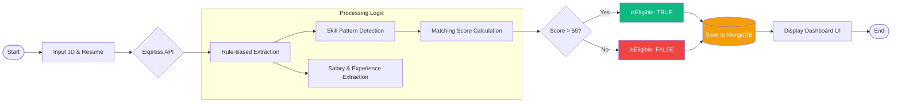

# 🚀 Rule-Based Resume Parsing & Job Matching System
**Hidani Tech Internship Assessment**

A highly scalable, algorithmic Applicant Tracking System (ATS) designed to mathematically cross-reference an applicant's PDF Resume against a target Job Description.

**⚠️ Core Constraint 100% Satisfied:** This engine strictly avoids all Generative AI services (OpenAI, Gemini, Claude, etc.). It utilizes `pdf-parse`, Context-Aware Regular Expressions (RegEx), and native NLP arrays to guarantee predictable, zero-hallucination parsing.


---

## 🎯 Evaluation Criteria Addressed

### 1. Extraction Accuracy (40%)
- **Salary & Experience:** Dynamically extracts `LPA`, `CTC`, `Years of Experience` via mathematical RegEx bounding configurations (calculating ranges directly from unformatted strings).
- **JD & Resume Skills Extraction:** Uses a case-insensitive discovery pipeline to detect capitalization behaviors, multi-word frameworks (`Spring Boot`, `React.js`), and symbols (`C++`) entirely from raw text.

### 2. Matching Logic & Score Calculation (25%)
Matches candidate skills specifically against the target JD ruleset. Calculates the matching score using precise mathematical thresholds:
`Matching Score = (Matched JD Skills / Total JD Skills) × 100`

### 3. Code Quality & Performance (30%)
- Structured Monorepo design separating `/frontend` and `/backend`.
- **Performance:** `multer` executes zero-disk memory buffering. The PDF binary never touches a hard drive, processing instantly within the active RAM footprint.

### 4. Bonus Points Full Scale Completion
- [x] **API Implementation:** Robust `/api/parse-and-match` Express Endpoint routing.
- [x] **Database Integration:** Mongoose schemas connected to MongoDB Atlas mapping full candidate eligibility logs.
- [x] **UI Implementation:** Professional layout featuring Glassmorphism, specific HR Color Psychology (Emerald/Gold), and Drag-and-Drop Dropzones via Vite & React.
- [x] **Docker Support:** Centralized orchestration leveraging standard `node:20-alpine` targets.

---

## 🔄 System Workflow

1. **Input Stage**: The HR user enters the Target Job Description (text) and uploads the Candidate Resume (PDF).
2. **Text Extraction**: The system uses `pdf-parse` to convert the binary PDF into a raw text string in the Express memory buffer.
3. **NLP Processing (Rule-Based)**: 
    - **Skill Matching**: Case-insensitive Regex comparisons find overlapping technical terms.
    - **Data Extraction**: Specialized Regex patterns capture Salary (LPA/₹ format) and Experience (Years/Fresher).
4. **Scoring Engine**: A mathematical formula calculates the percentage match based on JD requirements.
5. **Persistence**: The result, along with the timestamp and candidate name, is securely logged to **MongoDB Atlas**.
6. **Visualization**: The React dashboard renders a real-time Circular Progress Bar and Eligibility Badge (Green/Red).

---

## 📊 Detailed Project Flowchart



---

## 📄 Sample Output JSON Format
The API structurally maps identically to the payload required in the assignment logic.

```json
{
  "name": "Shubham Yadav",
  "salary": "14 LPA to 18 LPA",
  "yearOfExperience": null,
  "candidateSalary": "Not explicitly stated",
  "candidateExperience": 2,
  "isEligible": false,
  "resumeSkills": [
    "Machine Learning",
    "Tailwind CSS",
    "React.js",
    "Socket.io",
    "MongoDB",
    "YOLOv8",
    "Node.js",
    "SQL",
    "Express.js"
  ],
  "matchingJobs": [
    {
      "jobId": "JD-6654",
      "role": "Target Job Role",
      "aboutRole": "Syntax Solutions promotes an inclusive environment dedicated to strategic planning...",
      "skillsAnalysis": [
        { "skill": "React", "presentInResume": true },
        { "skill": "Docker", "presentInResume": false },
        { "skill": "Node", "presentInResume": true },
        { "skill": "MySQL", "presentInResume": true },
        { "skill": "Python", "presentInResume": true },
        { "skill": "Bash", "presentInResume": false }
      ],
      "matchingScore": 68
    }
  ]
}
```

---

## 🐳 Docker Deployment

We implemented an environment-agnostic Dockerization footprint encapsulating both services simultaneously.

1. Install [Docker Desktop](https://www.docker.com/).
2. Run the deployment manifest from the absolute root:
```bash
docker-compose up --build
```
3. The orchestration spins up the Backend on `localhost:5000` and the React interface on `localhost:5173`. 

---

## 💻 Manual Setup & Execution

### 1. Database Configuration
Create a `.env` file inside the `/backend` directory:
```env
PORT=5000
MONGO_URI=mongodb+srv://<username>:<password>@cluster.mongodb.net/hidani-tech
```

### 2. Run Backend
```bash
cd backend
npm install
node index.js
```

### 3. Run Frontend
```bash
cd frontend
npm install
npm run dev
```

---
*Copyright © 2026 | Built exclusively for Hidani Tech Assessment*
